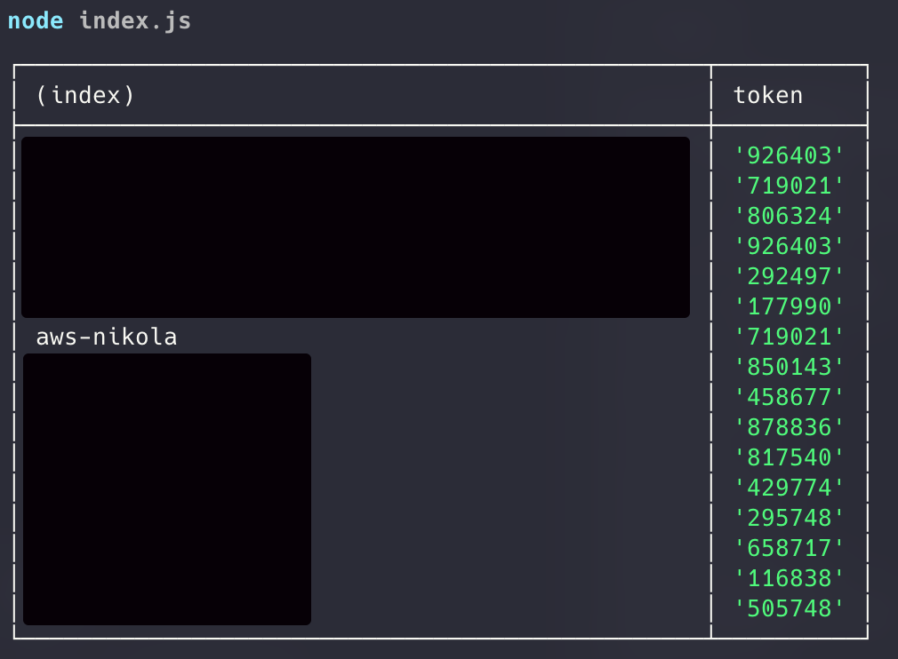
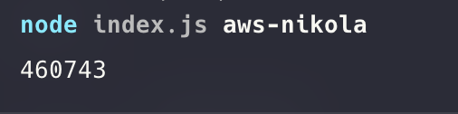
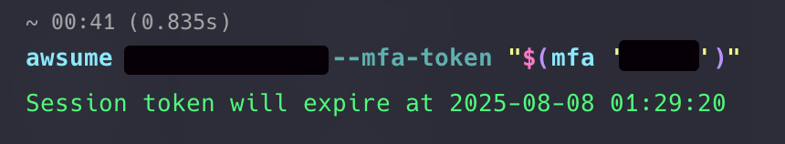

# TL;DR
```sh
npm install
```
Export mfa tokens from  Google Authenticator, screenshot and place screenshots in qrcodes folder

```sh
    node index.js
```

# About project
gMFA.js is a free and lightweight script that lets you access your Google Authenticator MFA codes on any operating system.

# Installation
This tutorial uses Node v23.11.0 and npm 10.9.2 but it should work with Bun and Yarn — or older Node versions. Sadly it does not work with Deno.

## Prerequirements
* Node or Bun
* yarn or npm or Bun (As package manager)

## Setup
Clone the repo

```
git clone https://github.com/nikola-matkovic/gMFA.js.git qr
```

Install packages
```
cd qr
npm install
```

On your phone, go to Google Authenticator → click menu icon ☰ → "Transfer accounts" (name may vary depending on device language).
Now export codes, select all MFA accounts you want to export, click Next.
It will show you a QR code — screenshot it and click Next.

If there are many MFA codes, there could be multiple QR codes.
When asked for removing accounts, click Keep existing codes.

Place QR screenshots inside the ```qrcodes``` folder.

# Usage
To show all codes:
```
    node index.js
```


To show only a specific code:
```
    node index.js code_name
```


You don’t need to type the full name — for example, in my case:  ``` node index.js nik``` would work just fine.
If there are multiple matches, it will return the first one.

# Adding new mfa codes
If you just added a new MFA account in Google Authenticator, you do not need to export all codes again — just export the new one, screenshot and save it to the qrcodes folder.

# Pro tips
You can make the script faster. Under the hood, it reads all QR codes and finds the MFA token you request — which can be slow if you have a lot of them.
Results are cached in the ```codes.json``` file — so if you want a cached result, simply add 1 before the MFA name:

```
node index.js 1 mfa_name
```
It will read from ```codes.json``` instead of scanning QR codes again.
This will work as long as you don’t add a new QR code. When you do, run: ```node index.js``` to update ```codes.json``` and cache the new MFA.

In codes.json there is also a secret that you should not share with anyone. You can also use it if you want to migrate to another MFA application different from Google.

# My working scenario / example
I wrote this script to solve a real problem — I work on a large number of AWS accounts, all with MFA enabled. Constantly checking my phone was annoying and time-consuming.

You can create an alias for running this script like so:

```alias mfa="node ~/work/scripts/qr/index.js 1" ```

Now I can simply run: ```mfa nikola``` when I want my AWS account MFA code. For console usage, I also integrated it with awsume: ```awsume```

```
awsume aws_profile_name --mfa-token "$(mfa 'mfa-name')"
```



You can further automate it to suit your needs and add aliases, but that is not within the scope of this script.

Happy hacking 💙
